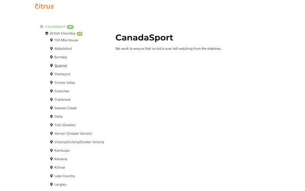

# Citrus Technical Interview

## Part 0a: Review product

Our platform is made up client facing applications using [React.js](https://create-react-app.dev/) and [Next.js](https://nextjs.org/) and an API built with [Nestjs](http://nestjs.com) based on the [Clean Architecture](https://khalilstemmler.com/articles/software-design-architecture/organizing-app-logic/), [SOLID principles](https://khalilstemmler.com/articles/solid-principles/solid-typescript/), and [Domain-Driven Design](https://khalilstemmler.com/articles/domain-driven-design-intro/) best practices using TypeScript. These principles should help us isolate logic so that we can eventually migrate to a micro service to assist with scaling.

## Part 0b: Technical challenge

> **View location details**
>
> 
>
> _As a director, I want to view specific location details within my company so that better manage and report on sales and engagement per location._
>
> Acceptance Criteria
> * Must be able to view all program's locations
> * Must be able to view the tree structure of a program
> * Programs can be made up of regions and locations

## Part 1: Frontend development

We will review some of the highlevel topics within React such as functional components, JSX, conditional rendering and basic hooks.

_Requirements_

* [Visual Studio Code](https://code.visualstudio.com/download)
  * [Live Share](https://marketplace.visualstudio.com/items?itemName=MS-vsliveshare.vsliveshare)

### React Fundamentals

1. Create a component that displays the tree
2. On click update the url to the node id
3. Depending on URL display the node on page load

## Part 2: Backend development (Coming Soon)

1. Create an endpoint for list of locations
2. Add and validate an email address
3. Create an endpoint for tree

### Part 3: Specialities (Coming Soon)

### User Interface / User Experience (Coming Soon)

### DevOps (Coming Soon)
